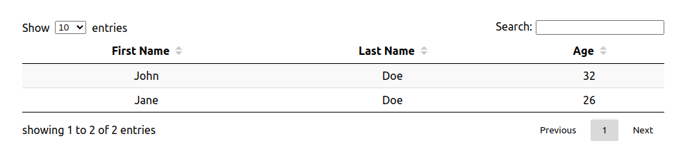
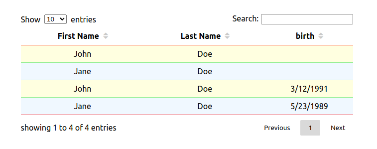

# React Data Table

**WARNING : as this is a school project, I will not maintain nor provide support for it**

A simple react library for displaying data as an html table. Features pagination, filtering results and column sorting with realtive ease of style customization.

## Installation

```console
npm i mb-react-data-table
```

## Basic usage

### Import the component:

```js
import DataTable from "mb-react-data-table";
```

### Define your data as an array of object :

```js
const data = [
  {
    firstName: "John",
    lastName: "Doe",
    age: 32,
  },
  {
    firstName: "Jane",
    lastName: "Doe",
    age: 26,
  },
];
```

### Configure your columns

the **_name_** attribute will be displayed as column header, the **_dataKey_** attribute will reference the attribute of the data object

```js
const columns = [
  {
    name: "First Name",
    dataKey: "firstName",
  },
  {
    name: "Last Name",
    dataKey: "lastName",
  },
  {
    name: "Age",
    dataKey: "age",
  },
];
```

### Use the component

```js
import DataTable from "mb-react-data-table";

const App = () => {
  const data = [
    {
      firstName: "John",
      lastName: "Doe",
      age: 32,
    },
    {
      firstName: "Jane",
      lastName: "Doe",
      age: 26,
    },
  ];

  const columns = [
    {
      name: "First Name",
      dataKey: "firstName",
    },
    {
      name: "Last Name",
      dataKey: "lastName",
    },
    {
      name: "Age",
      dataKey: "age",
    },
  ];

  return <DataTable columns={columns}>{data}</DataTable>;
};
```

### Result



## More usages

### Custom sort function

By default the sorting is done lexicographically. If you need another sorting mechanism, you can provide a custom sort function in the header configuration.

For example in the above case, to sort on the **_age_** attribute :

```js
const columns = [
  {
    name: "First Name",
    dataKey: "firstName",
  },
  {
    name: "Last Name",
    dataKey: "lastName",
  },
  {
    name: "Age",
    dataKey: "age",
    sortFn: (a, b) => a - b,
  },
];
```

The **_sortFn_** will receive the values of the **_age_** attributes and must return a number, just like the [Array.prototype.sort](https://developer.mozilla.org/en-US/docs/Web/JavaScript/Reference/Global_Objects/Array/sort) **_compareFn_** parameter.

You only need to specify a sortFn that sorts in ascending order. The descending order is handled by the library by taking the opposite of your **_sortFn_** returned value.

### Objects in data and formating

Sometimes your data will contain some non-primitive values, like Date objects

```js
const data = [
  {
    firstName: "John",
    lastName: "Doe",
    dateOfBirth: new Date("1991-03-12"),
  },
  {
    firstName: "Jane",
    lastName: "Doe",
    dateOfBirth: new Date("1989-05-23"),
  },
];
```

By default the library will format the value using the **.toString()** method. If you need another formating logic, you can provide a formater function in the columns configuration :

```js
const columns = [
  {
    name: "First Name",
    dataKey: "firstName",
  },
  {
    name: "Last Name",
    dataKey: "lastName",
  },
  {
    name: "Date of Birth",
    dataKey: "dateOfBirth",
    formater: date => date.toLocaleDateString(),
  },
];
```

### Row key

Since the component renders a list of rows, react needs a unique key attribute to be set on each row.

If your data contains an **_id_** attribute, for example:

```js
const data = [
  {
    id: "394d6c90-2763-49e6-b270-a4f41659e2b2",
    firstName: "John",
    lastName: "Doe",
    age: 32,
  },
  {
    id: "4ffa6b7f-1df3-448d-8eb9-a22a5a69ca89",
    firstName: "Jane",
    lastName: "Doe",
    age: 26,
  },
];
```

it will automatically be used as the key for each row.

You can also customize the generated key by passing a function in the prop **_rowKeyProducer_**. This function will receive the data object and must returns a string. For example :

```js
import DataTable from "mb-react-data-table";

const App = () => {
  const data = [
    {
      firstName: "John",
      lastName: "Doe",
      age: 32,
    },
    {
      firstName: "Jane",
      lastName: "Doe",
      age: 26,
    },
  ];

  const columns = [
    {
      name: "First Name",
      dataKey: "firstName",
    },
    {
      name: "Last Name",
      dataKey: "lastName",
    },
    {
      name: "Age",
      dataKey: "age",
    },
  ];

  return (
    <DataTable
      columns={columns}
      rowKeyProducer={data => `${data.firstName}-${data.lastName}-${data.age}`}
    >
      {data}
    </DataTable>
  );
};
```

The returned value will be used as the key for the row, so it must be unique among rows, otherwise react will throw the warning about non-unique keys

## Styling

### Simple color styling

In case you need to change the colors of

- the border color of the table
- the border color of the rows
- the backgound color of even rows
- the background color of odd rows

You can override some css custom properties used by the component.

Create a class and set the custom properties you want to override:

```css
.table {
  --table-border-color: red;
  --row-border-color: lightgreen;
  --row-even-bg-color: aliceBlue;
  --row-odd-bg-color: lightyellow;
}
```

Apply this class to the component :

```js
<DataTable columns={columns} className="table">
  {data}
</DataTable>
```

Results :



_you may need to increase your css rule specificity to properly override the defaults_

### More controls over styling

If you need to apply more styles, you can pass classNames to the component :

```js
<DataTable
  columns={columns}
  className="className" // will be applied to the main component
  tableClassName="tableClassName" // will be applied to the table element
  headerClassName="headerClassName" // will be applied to the tr element that contains the th elements
  rowClassName="rowClassName" // will be applied to all the tr elements that contains the td elements
  cellClassName="cellClassName" // will be applied to all the td elements
>
  {data}
</DataTable>
```

## Additional components

This library provide four additional components alongside the main table components. These are the search box, the number of displayed rows selection, the column headers, and the pagination.

Optional render props are available on the table component for each of these in case you need full control over them. They are also exported as named export, in case you just need some small tweaks to the defaults. Let's take the number of displayed rows as an example to see how it works.

### Reusing the default

Let's say you want the user to be able to choose between a list of 10 or 15 or 20, instead of the default 10 or 25 or 50 or 100.

First, import the components:

```js
import DataTable, { EntriesNumberSelection } from "mb-react-data-table;
```

Declare your data and your columns configuration as always (we will skip this part here), and pass the render prop to the DataTable component as such:

```js
<DataTable
  columns={columns}
  renderEntriesNumberSelection={props => (
    <EntriesNumberSelection {...props} availableNumbers={[10, 15, 20]} />
  )}
>
  {data}
</DataTable>
```

It works the same for the other components. The logic is you can have full control over these additional parts with the render props if you need to, but you can also reuse the exported components for convenience, especially if you only need some custom styles.

### Custom styling

The exported components can receive some classNames to have full control over the styles, but just like the main table components you will be able to override some css custom properties in case you just need some color customization. This documentation will provide additional details on that in the section dedicated to each components.

## Components documentation

### DataTable

The main componenet of this library. Will render your data as an html table.

| props                        | required | type                                                                                                                                         | description                                                                                                                                                                                                                                                                                                                                           |
| ---------------------------- | -------- | -------------------------------------------------------------------------------------------------------------------------------------------- | ----------------------------------------------------------------------------------------------------------------------------------------------------------------------------------------------------------------------------------------------------------------------------------------------------------------------------------------------------- |
| columns                      | yes      | { name: string, dataKey: string, sortFn?: (a, b) => number, formater?: value => string, }[]                                                  | This is where you provide the columns configuration. A column configuration is an object with a "name" property (required, that will be displayed in the table header), a "dataKey" property (required, it must match one of the property of the data passed in the children prop). Optionally you can define a sort function and a formater function |
| children                     | yes      | array of object                                                                                                                              | This is where you pass your data. Each object of this array will be a row in the table. The values of these objects will be cells in the table, and are placed in the columns where their key matches the "dataKey" of the columns configuration.                                                                                                     |
| rowKeyProducer               | no       | (dataObject) => string                                                                                                                       | Optional. Used to generate (react) keys for a row. Will receive the data object, and will be called for each rows. It defaults to a function that tries to read an "id" attribute (if it exists) on the data object                                                                                                                                   |
| initialEntriesNumber         | no       | number                                                                                                                                       | Optional. Used to set the number of entries shown initially. Defaults to 10                                                                                                                                                                                                                                                                           |
| className                    | no       | string                                                                                                                                       | Adds a css class to this component                                                                                                                                                                                                                                                                                                                    |
| tableClassName               | no       | string                                                                                                                                       | Adds a css class to the table element                                                                                                                                                                                                                                                                                                                 |
| headerClassName              | no       | string                                                                                                                                       | Adds a css class to the table header row (the tr element containing the th elements)                                                                                                                                                                                                                                                                  |
| rowClassName                 | no       | string                                                                                                                                       | Adds a css class to the table body rows (all the tr elements containing the td elements)                                                                                                                                                                                                                                                              |
| cellClassName                | no       | string                                                                                                                                       | Adds a css class to all table body cells (all the td elements)                                                                                                                                                                                                                                                                                        |
| renderEntriesNumberSelection | no       | ({ selectedNumber: number, setSelectedNumber: (number) => void, }) => React.node                                                             | Optional. Render prop. Controls the selection of the number of entries displayed. Receive the currently selected number of entries, and a function to set it to a new value.                                                                                                                                                                          |
| renderSearchEntries          | no       | ({ search: string, setSearch: (string) => void, }) => React.node                                                                             | Optional. Render Prop. Controls the search box for filtering the results. Receive the currently searched text, and a function to set it to a new value.                                                                                                                                                                                               |
| renderPagination             | no       | ({ currentPage: number, pageTotal: number, setCurrentPage: (page: number) => void, incrementPage: (amount: number) => void, )} => React.node | Optional. Render Prop. Controls the pagination. Receive the current page (starting at 1, so the first page is page 1), the total of pages, a function to set the current directly, and a function to increment the page by an amount (can be negative)                                                                                                |
| renderColumnHeader           | no       | ({ name: string, onClick: () => void, sortStatus: SortStatus, key: string }) => React.node                                                   | Optional. Render props. Controls each table header cells. Will receive the name of the column, an onClick callback that will switch the sort status when called, the current sort status and the current dataKey                                                                                                                                                  |

### EntriesNumberSelection

The default component used to select the number of entries (rows) displayed.

| props            | required | type             | description                                                                         |
| ---------------- | -------- | ---------------- | ----------------------------------------------------------------------------------- |
| selectedNumber   | yes      | number           | The currently selected number.                                                      |
| setEntriesNumber | yes      | (number) => void | A function to set the number of displayed entries to a new value                    |
| availableNumbers | no       | number[]         | The numbers available for the user to choose from.<br>Defaults to [10, 25, 50, 100] |
| className        | no       | string           | Add a css class to the component                                                    |

### Pagination

The default component used to paginate the results.

| props                     | required | type                     | description                                                             |
| ------------------------- | -------- | ------------------------ | ----------------------------------------------------------------------- |
| currentPage               | yes      | number                   | The currently selected page. It starts at 1, (so the first page is 1)   |
| pageTotal                 | yes      | number                   | The number of pages                                                     |
| setCurrentPage            | no       | (number) => void         | A function to set the current page to a new value                       |
| incrementPage             | no       | (amount: number) => void | A function to increase or decrease the current page by "amount"         |
| className                 | no       | string                   | Adds a css class to the component                                       |
| paginationButtonClassName | no       | string                   | Adds a css class to all the pagination button elements                  |
| activeClassName           | no       | string                   | Adds a css class to the pagination button that matches the current page |

These css variables are applied to the component level, and can be overridden :

```css
--pagination-button-bg-color: transparent; /* controls the background color of the pagination buttons */
--pagination-button-disabled-bg-color: transparent; /* controls the background color of the disabled pagination buttons */
--pagination-button-hover-bg-color: rgba(0, 0, 0, 0.1); /* controls the background color of the pagination buttons when hovered */
--pagination-button-active-bg-color: rgba(0, 0, 0, 0.15); /* controls the background color of the pagination button that matches the current page */
```

### Search Entries

The default component used to filter the results

| props          | required | type             | description                                         |
| -------------- | -------- | ---------------- | --------------------------------------------------- |
| search         | no       | string           | The currently searched value                        |
| setSearch      | no       | (string) => void | A function to set the current search to a new value |
| className      | no       | string           | Adds a css class to the component                   |
| inputClassName | no       | string           | Adds a css class to the input element               |

### Column header

The default component used to render the table header cells.

| props            | required | type       | description                                                                                                                       |
| ---------------- | -------- | ---------- | --------------------------------------------------------------------------------------------------------------------------------- |
| name             | yes      | string     | The displayed column name                                                                                                         |
| sortStatus       | no       | SortStatus | The current sort status of this column. If you need to set or read this, use the provided SortStatus object (it acts as an enum). |
| onClick          | no       | fn         | Called back when the component is clicked                                                                                         |
| className        | no       | string     | Adds a css class to the component                                                                                                 |
| contentClassName | no       | string     | Adds a css class to the button wrapping the name of the column                                                                    |
| activeClassName  | no       | string     | Adds a css class to the caret matching the sort status of the column                                                              |

These css variables are applied to the component level, and can be overridden :

```css
--caret-color: rgb(201, 201, 201); /* controls the color of the carets */
--caret-active-color: inherit; /* controls the color of the caret matching the sort status */
```
